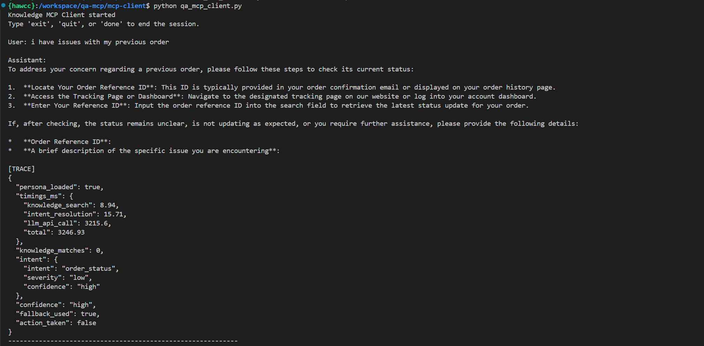

# Knowledge-Powered Q&A and Action Bot (MCP)

**Author:** Mohan Chandra S S  
**GitHub:** https://github.com/mohanchandrass/QA-MCP-Server

---

## Index
1. [Overview](#1-overview)  
2. [Architecture Summary](#2-architecture-summary)  
3. [Repository Structure](#3-repository-structure)  
4. [Execution Guide (Copy–Paste Ready)](#4-execution-guide-copypaste-ready)  
   - [Prerequisites](#prerequisites)  
   - [Step-by-Step Execution](#step-0-navigate-to-project-root)  
5. [Runtime Flow (End-to-End)](#5-runtime-flow-end-to-end)  
6. [Configuration-Driven Design & Industry Switching](#6-configuration-driven-design--industry-switching)  
7. [Decision Logic & Escalation Policy](#7-decision-logic--escalation-policy)  
8. [Role of the LLM](#8-role-of-the-llm)  
9. [Observability & Trace Logs](#9-observability--trace-logs)  
10. [Output Examples](#10-output-examples)  
11. [Extensibility & Upgrade Path](#11-extensibility--upgrade-path)  
12. [Why This Design Works](#12-why-this-design-works)  
13. [Summary](#13-summary)

---

## 1. Overview

This project implements a **Knowledge-Powered Q&A and Action Bot** using the **Model Context Protocol (MCP)**.

The system is designed to:
- Answer user queries using a configurable knowledge base
- Resolve user intent deterministically from configuration
- Allow an LLM (Gemini) to handle the majority of conversations
- Escalate to a human agent only when required
- Trigger actions (e.g., ticket creation) in a controlled, auditable manner
- Support instant industry switching by swapping configuration files only

All decision-making logic is **configuration-driven**, while the **LLM is strictly limited to language generation**. This ensures enterprise safety, predictability, and auditability.

---

## 2. Architecture Summary

The system consists of **two decoupled components**.

### MCP Server (Dockerized)
- Exposes MCP resources:
  - `knowledge://search`
  - `config://persona`
  - `config://intents`
  - `config://actions`
- Resolves intent using deterministic rules (no LLM in server)
- Executes actions only when explicitly invoked
- Stateless and reproducible

### MCP Client (LLM-Integrated)
- Queries MCP resources
- Uses Gemini for natural language generation
- Enforces escalation and sampling policies from configuration
- Explicitly triggers MCP action tools
- Emits full trace logs for observability

### High-Level Flow
```
User
 └─> MCP Client (LLM + Policy Enforcement)
      ├─> MCP Resource: knowledge://search
      ├─> MCP Tool: resolve_intent
      ├─> Decision Logic (from actions.yaml)
      └─> MCP Tool: create_ticket (if required)
           └─> MCP Server
```

---

## 3. Repository Structure
```
qa-mcp/
├── mcp-client/
│   ├── qa_mcp_client.py
│   ├── requirements.txt
│   └── tests/
└── mcp-server/
    ├── qa_mcp_server.py
    ├── Dockerfile
    ├── requirements.txt
    ├── config/
    │   ├── persona.yaml
    │   ├── intents.yaml
    │   └── actions.yaml
    └── data/
        └── knowledge.json
```

---

## 4. Execution Guide (Copy–Paste Ready)

### Prerequisites
- Python 3.11+
- Docker
- Gemini API Key

---

### Step 0: Navigate to Project Root
```bash
cd qa-mcp
```

---

### Step 1: Install MCP Client Dependencies (Required)
```bash
cd mcp-client
pip install -r requirements.txt
```

---

### Step 2: Set LLM API Key
```bash
export GEMINI_API_KEY=your_api_key_here
```

---

### Step 3: Run the MCP Server
```bash
cd ..
```

---

### Step 4: Run the MCP Client
```bash
cd qa-mcp/mcp-client
python qa_mcp_client.py
```

---

## 5. Runtime Flow (End-to-End)
1. Client reads MCP resources
2. Knowledge search executed
3. Intent resolved deterministically
4. LLM generates response
5. Policies evaluated
6. Action triggered only if required
7. Trace emitted

---

## 6. Configuration-Driven Design & Industry Switching

All behavior is externalized:
- `persona.yaml`
- `intents.yaml`
- `actions.yaml`

---

## 7. Decision Logic & Escalation Policy

### Core Principle
The LLM never decides escalation.

---

## 8. Role of the LLM

Used only for:
- Natural language generation
- Persona tone
- Knowledge explanation

---

## 9. Observability & Trace Logs

Every interaction emits:
- Knowledge latency
- Intent latency
- LLM latency
- Action latency
- Escalation decision

---

## 10. Output Examples



---

## 11. Extensibility & Upgrade Path

Designed for future scaling and industry adaptation.

---

## 12. Why This Design Works
- Deterministic control
- Safe LLM usage
- Config-driven reuse

---

## 13. Summary

Production-grade MCP architecture with auditable control.
